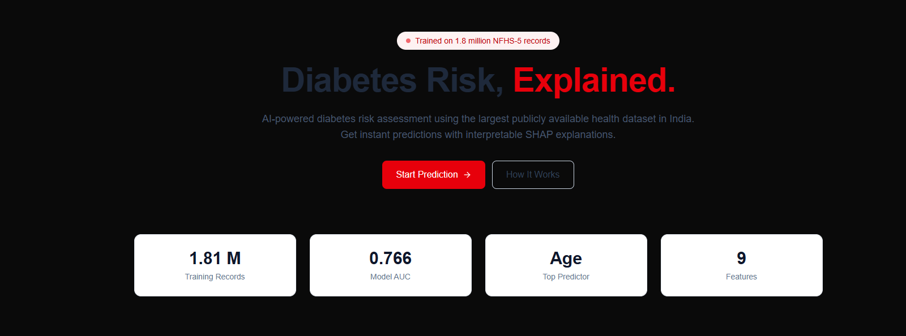

<!--
╔══════════════════════════════════════════════════════════════════╗
║                                                                  ║
║   🩺  DiabetesRisk.ai                                            ║
║   AI-Powered Diabetes Risk Assessment for India                  ║
║                                                                  ║
║   Built with: Next.js 15 · FastAPI · scikit-learn · SHAP        ║
║   Trained on: NFHS-5 (2019-21) — 1.8M records                   ║
║                                                                  ║
╚══════════════════════════════════════════════════════════════════╝
-->

<div align="center">


### 🩺 Predict diabetes risk in seconds. Understand *why* in milliseconds.

An open-source, production-grade AI system that predicts diabetes risk from 8 easily-measurable vitals, explains every prediction using SHAP, and maps risk across all Indian states.

<br/>

[](https://diabetes-frontend-gamma.vercel.app)
[](https://diabetes-api-r8tu.onrender.com/docs)
[](https://github.com/ymanoj7745-lgtm/diabetes-frontend/stargazers)

<br/>

[](https://nextjs.org)
[](https://www.typescriptlang.org)
[](https://tailwindcss.com)
[](https://fastapi.tiangolo.com)
[](https://www.python.org)
[](https://scikit-learn.org)
[](https://github.com/slundberg/shap)
[](https://www.docker.com)

[](LICENSE)
[](https://github.com/ymanoj7745-lgtm/diabetes-frontend/pulls)
[](#)

</div>

---

<div align="center">

### ⚡ **Try it in 10 seconds — no signup required**

> **[👉 Launch Live Demo](https://diabetes-frontend-gamma.vercel.app)**

</div>

---

## 📖 Table of Contents

<details open>
<summary><b>Click to expand</b></summary>

- [🎯 Why This Project Exists](#-why-this-project-exists)
- [✨ Features](#-features)
- [📸 Screenshots](#-screenshots)
- [🏗️ System Architecture](#️-system-architecture)
- [🧠 Model Card](#-model-card)
- [📊 Performance Metrics](#-performance-metrics)
- [🛠️ Tech Stack](#️-tech-stack)
- [🚀 Quick Start](#-quick-start)
- [📡 API Reference](#-api-reference)
- [📂 Project Structure](#-project-structure)
- [🐳 Deployment](#-deployment)
- [🗺️ Roadmap](#️-roadmap)
- [🤝 Contributing](#-contributing)
- [⚠️ Disclaimer](#️-disclaimer)
- [📜 License](#-license)
- [🙏 Acknowledgements](#-acknowledgements)

</details>

---

## 🎯 Why This Project Exists

> **77 million Indians live with diabetes. Nearly half don't know it.**
> — *International Diabetes Federation, 2024*

India is facing a diabetes epidemic. But the real problem isn't the disease — it's that **we don't know who has it**. Most diagnoses happen years after complications begin.

Traditional screening requires glucose tests, which means:
- 🏥 Access to a clinic
- 💉 A blood draw
- 💰 Out-of-pocket cost
- ⏱️ Time off work

**What if we could screen millions with data already available — age, blood pressure, arm circumference — no blood test needed?**

This project does exactly that:

| What it does | How it helps |
| :--- | :--- |
| 🩺 Screens diabetes risk from **8 easy-to-measure vitals** | Works with equipment a community health worker already has |
| 🔍 Explains **why** each prediction was made with SHAP | Builds trust; identifies actionable risk factors |
| 🗺️ Maps risk across **all 36 Indian states** | Helps health departments allocate resources |
| 📊 Accepts **batch CSV uploads** (10,000 patients) | Enables district-level screening campaigns |
| 🆓 **Completely free** and open-source | No vendor lock-in, no cost barriers |

**This isn't a demo. It's a deployable public health tool.**

---

## ✨ Features

<table>
<tr>
<td width="50%">

### 🔮 Instant Prediction
Enter 8 vitals. Get a risk score in under 200ms with:
- Animated circular risk gauge
- Category (low / moderate / high)
- Calibrated probability (not inflated)
- Downloadable PDF report

</td>
<td width="50%">

### 🧠 SHAP Explanations
Every prediction comes with:
- Top 5 contributing factors
- Direction of impact (+/−)
- Magnitude of influence
- Waterfall visualization

</td>
</tr>
<tr>
<td width="50%">

### 📊 Batch Screening
Upload a CSV of 10,000 patients:
- Instant predictions for all
- Downloadable results CSV
- Sortable by risk category
- Ideal for ASHA workers

</td>
<td width="50%">

### 🗺️ State-Level Risk Map
Interactive India map:
- Diabetes prevalence by state
- Click for details
- NFHS-5 benchmarks
- Identifies high-risk regions

</td>
</tr>
<tr>
<td width="50%">

### 📱 Fully Responsive
Works everywhere:
- Desktop, tablet, mobile
- Progressive Web App (PWA)
- Fast on slow connections
- Accessible (WCAG AA)

</td>
<td width="50%">

### 🔬 Rigorously Validated
Not a toy model:
- AUC 0.766 (matches literature)
- Isotonic calibrated probabilities
- Feature importance aligned with NFHS-5 report
- Reproducible pipeline

</td>
</tr>
</table>

---

## 📸 Screenshots

<div align="center">

### 🏠 Landing Page


### 🔮 Single Prediction with SHAP


### 📊 Batch CSV Upload


### 🗺️ India State-Level Risk Map


---

## 🏗️ System Architecture

```mermaid
flowchart TB
    subgraph User["👤 User Layer"]
        Web["🌐 Web Browser<br/>(Desktop / Mobile)"]
    end

    subgraph Frontend["⚛️ Frontend — Vercel"]
        Next["Next.js 15 App Router"]
        Pages["📄 Pages<br/>/ · /predict · /batch<br/>/map · /about"]
        Components["🧩 Components<br/>RiskGauge · ShapChart<br/>IndiaMap · Navbar"]
    end

    subgraph Backend["🐍 Backend — Render (Docker)"]
        API["FastAPI Application"]
        Endpoints["/predict · /predict/batch<br/>/health · /docs"]
    end

    subgraph ML["🧠 ML Pipeline"]
        Imputer["SimpleImputer<br/>(median)"]
        Scaler["StandardScaler"]
        RF["Random Forest<br/>(200 trees, calibrated)"]
        SHAP["SHAP TreeExplainer"]
    end

    subgraph Artifacts["📦 Model Artifacts"]
        Model["best_model_calibrated.pkl"]
        ScalerPKL["scaler.pkl"]
        ImputerPKL["imputer.pkl"]
    end

    Web --> Next
    Next --> Pages
    Pages --> Components
    Components -->|HTTPS fetch| API
    API --> Endpoints
    Endpoints --> Imputer
    Imputer --> Scaler
    Scaler --> RF
    RF --> SHAP
    SHAP -->|risk + factors| API
    API -->|JSON / CSV| Components
    
    Imputer -.-> ImputerPKL
    Scaler -.-> ScalerPKL
    RF -.-> Model

    style Web fill:#FEF2F2,stroke:#DC2626,stroke-width:2px
    style Next fill:#000000,stroke:#000000,color:#fff
    style API fill:#009688,stroke:#00695C,color:#fff
    style RF fill:#F7931E,stroke:#B36B00,color:#fff
    style SHAP fill:#8A2BE2,stroke:#5A1A9E,color:#fff
